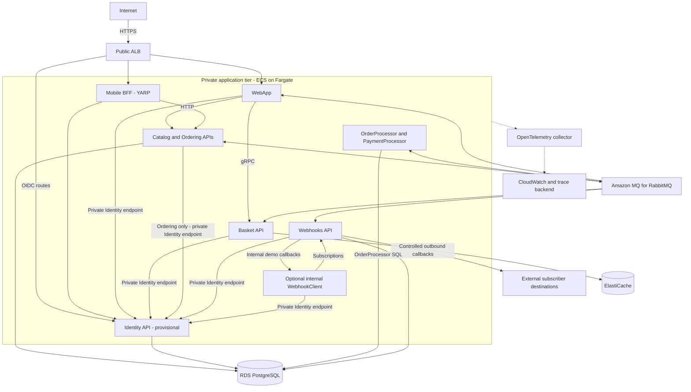

# AWS target-architecture proposal

Status: candidate design, not a deployed or validated AWS architecture. Sources: `src/eShop.AppHost/Program.cs`, `src/eShop.AppHost/Extensions.cs`, the [repository map](repository-map.md), [development environment](development-environment.md), and [local baseline](development-baseline.md).

**Aspire is the local development orchestrator, not the production runtime in this proposal.** Local Windows processes and Linux infrastructure containers remain the development model. ECS would manage production containers; AppHost references, service discovery, configuration, and startup dependencies require explicit deployment equivalents.

## Proposed topology

Grouped arrows summarize dependencies, not universal access permissions. Preserve WebApp's HTTP/gRPC split. Current mobile BFF routes exclude Basket; packaging YARP for ECS needs verification because it is an AppHost resource, not a separate source project.

AppHost sets `IdentityUrl` for WebApp/WebhookClient and `Identity__Url` for Basket/Ordering/Webhooks. These callers require private reachability to Identity through service discovery; external Identity access must be limited to required browser/OIDC routes through the ALB. Keep internal resolution consistent with the chosen issuer, metadata, and TLS configuration.

`src/Webhooks.API/Services/WebhooksSender.cs`, `OnSendData`, sends callbacks to subscription destinations. The internal demo WebhookClient is distinct from external subscribers. Production requires an explicit outbound-egress and SSRF-control design: approve destinations, block private/link-local targets for external subscriptions, and validate DNS resolution and redirects. Any internal demo exception must be narrowly isolated. These controls are requirements, not claimed existing protections.

## AppHost resource mapping

| Actual resource | AWS candidate |
| --- | --- |
| `aca` | ECS deployment environment; Azure declaration is not portable infrastructure. |
| `postgres` | RDS PostgreSQL, subject to extension compatibility. |
| `catalogdb` | Logical RDS database for Catalog and its event log. |
| `identitydb` | Logical RDS database if Identity API is retained. |
| `orderingdb` | Logical RDS database shared by Ordering and OrderProcessor. |
| `webhooksdb` | Logical RDS database for subscriptions. |
| `redis` | ElastiCache; Redis OSS/Valkey decision pending. |
| `eventbus` | Private Amazon MQ for RabbitMQ. |
| `identity-api` | ECS/Fargate service provisionally; identity strategy pending. |
| `basket-api` | Internal ECS/Fargate gRPC service. |
| `catalog-api` | Internal ECS/Fargate HTTP service. |
| `ordering-api` | Internal ECS/Fargate HTTP service. |
| `order-processor` | ECS/Fargate worker with Ordering database access. |
| `payment-processor` | ECS/Fargate worker; remains simulated payment processing. |
| `webhooks-api` | ECS/Fargate service with controlled callback egress. |
| `mobile-bff` | Containerized YARP candidate behind ALB. |
| `webapp` | ECS/Fargate service behind ALB. |
| `webhooksclient` | Optional ECS/Fargate demonstration client; exposure reviewed separately. |
| `foundry`, `chatModel`, `textEmbeddingModel` | Conditional `UseFoundry` resources; defer AI-provider decision, no assumed AWS equivalent. |
| `ollama`, `embedding`, `chat` | Disabled branch; exclude from initial target. |

MAUI clients are not AppHost-managed deployments. Initially preserve four logical databases on one PostgreSQL deployment; revisit isolation separately.

## Network and security baseline

- Two-AZ VPC minimum; public ALB is the only public application ingress. Keep tasks without public IPs and data services in private tiers.
- Security groups allow only required ALB-to-service, service-to-service, and service-to-data flows. Plan controlled outbound access and private service discovery.
- Provide private Identity discovery and security-group access from WebApp, Basket, Ordering, Webhooks, WebhookClient, and the BFF; allow ALB access only for required browser/OIDC routes. Define separate permitted webhook callback egress.
- Use least-privilege IAM task roles, separate execution permissions, managed secrets outside source control, and rotation ownership.
- Require TLS at ingress and for data connections; define internal TLS and certificate management. Review forwarded headers, OIDC callbacks, Blazor connection routing, and shared key persistence.
- `MapDefaultEndpoints` in `src/eShop.ServiceDefaults/Extensions.cs` exposes `/health` and `/alive` only in Development. These endpoints are not sufficient deployment evidence. Require an intentional production health/readiness design before configuring ALB/ECS health behavior or treating this target as deployable.
- Replace sample signing assumptions; define migration gates, backups, recovery, and message replay before production.

## Deployment boundary and open decisions

ECR images and ECS/Fargate services are candidates. **Infrastructure-as-code choice is intentionally deferred.** AWS documents [ALB/ECS integration](https://docs.aws.amazon.com/AmazonECS/latest/developerguide/service-load-balancing.html), [RDS PostgreSQL](https://docs.aws.amazon.com/AmazonRDS/latest/UserGuide/CHAP_PostgreSQL.html), [ElastiCache](https://docs.aws.amazon.com/AmazonElastiCache/latest/dg/WhatIs.html), and [MQ RabbitMQ](https://docs.aws.amazon.com/amazon-mq/latest/developer-guide/working-with-rabbitmq.html); compatibility still requires validation.

- **pgvector:** verify supported extension/version, migrations, privileges, and managed operating model; RDS does not run the local pgvector image.
- **Cache:** choose Redis OSS versus Valkey after client, TLS, authentication, and persistence checks.
- **Identity:** harden Identity API or adapt to another provider; no drop-in replacement assumed.
- **Availability:** distinguish single-AZ learning resources from production HA; expand beyond two AZs where selected broker topology requires it.
- **Cost guardrails:** agree budgets, alerts, sizing limits, retention, and teardown ownership before provisioning.
- **CI/CD:** choose federation, image scanning, promotion, migration execution, rollback, and deployment verification.

## Not done

This document deploys nothing and claims no Free Tier eligibility. No resources were provisioned, credentials accessed, deployment commands run, or AWS account configuration verified. Local test success is not AWS deployment evidence.
