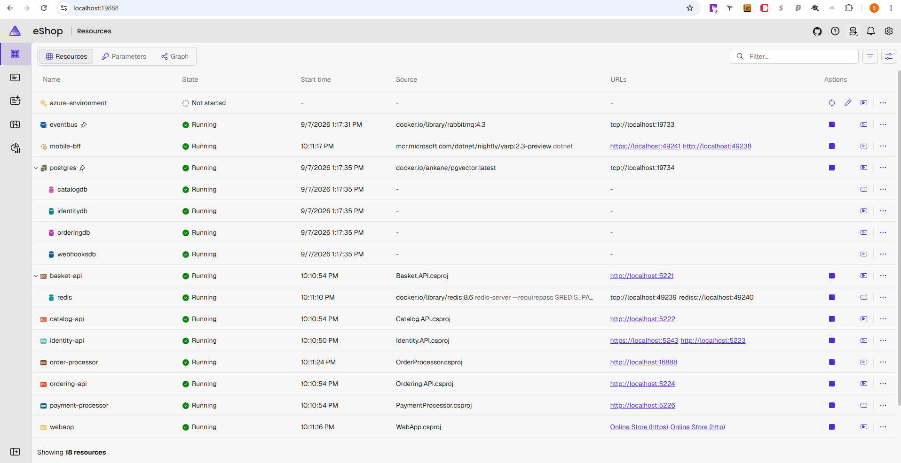

## Runtime evidence

The Aspire dashboard screenshot below was captured locally after AppHost and its resources started successfully. It excludes the authenticated dashboard URL and other local identifiers.



# Verified development baseline

This record documents the eShop development baseline established on **2026-09-07**. Results below are historical evidence; no tests were rerun for this documentation-only change. For installation and local configuration, see [the Windows development-environment guide](development-environment.md).

## Scope

- Windows 11 local development.
- .NET/Aspire application processes running on Windows.
- Docker Desktop using WSL2 and Linux containers for infrastructure.
- Repository identity, checkout location, and credentials omitted.

## Verified successful outcomes

| Check | Recorded result |
| --- | --- |
| `docker run --rm hello-world` | Succeeded. |
| `aspire run` | Started AppHost; the application worked when accessed through the dashboard. |
| `dotnet test --solution eShop.Web.slnf` | 122 total, 122 succeeded, 0 failed, 0 skipped; approximately 1 minute 36 seconds. |
| `npm ci` | 6 packages added, 7 audited, 0 vulnerabilities reported. |
| `npm run test:e2e` | 4 passed; approximately 1.5 minutes. |
| Final Git working tree | Clean. |

Timings and package-audit results describe that run, not guarantees for later installations or executions.

## Non-blocking warning

`ASPIRE010` appeared for AppHost and functional-test projects. It did not fail the baseline. Do not suppress it without separately evaluating `AspireUseCliBundle` and the implications for those projects.

## Problems discovered and resolutions

| Observed issue | Resolution or finding |
| --- | --- |
| First Aspire startup exceeded its initial timeout. | Cold build/startup work delayed readiness. Subsequent successful startup established that the application could run locally. |
| Playwright readiness encountered local development-certificate errors. | The merged fix scoped `ignoreHTTPSErrors` to Playwright's `webServer` readiness check in `playwright.config.ts`. This was not a global certificate-validation bypass. |
| Playwright required login configuration. | Supplied `USERNAME1` and `PASSWORD` privately through an ignored root `.env`; no credential values belong in this record. |
| A later diagnostic run showed connection refusals while Aspire was still starting near the former 60-second limit. | The merged fix increased the local Playwright `webServer` timeout to three minutes. Connection refusals during that interval were consistent with startup still being in progress. |
| Catalog OpenAPI JSON files were regenerated by build/test. | Inspected `src/Catalog.API/Catalog.API.json` and `src/Catalog.API/Catalog.API_v2.json`, confirmed the changes were unintended baseline noise, and restored them. |
| C# Dev Kit navigation did not work until a solution was loaded. | Explicitly loaded `eShop.slnx` to enable project-aware navigation. |

## Interpretation and remaining limitation

**Verified outcomes:** Docker execution, application startup, the recorded .NET and Playwright suites, dependency installation, and the final clean working tree succeeded. These establish a usable local development baseline, not production readiness or exhaustive correctness.

**Warning:** `ASPIRE010` remained non-blocking and requires separate evaluation rather than automatic suppression.

**Resolved local-environment issues:** Startup timing, Playwright HTTPS readiness, private login configuration, generated-file noise, and solution loading were addressed as recorded above.

**Remaining CI limitation:** `.github/workflows/playwright.yml` uses `ESHOP_USE_HTTP_ENDPOINTS=1`. CI therefore does not validate the local HTTPS readiness path. A passing CI run alone does not confirm the development-certificate behavior exercised locally. `playwright.config.ts` retains a five-minute CI timeout and a three-minute local timeout.

## Reproduction commands

Complete the linked environment guide first, including Docker Desktop startup and the ignored `.env` configuration. Run from the repository root in PowerShell:

```powershell
docker run --rm hello-world
npm ci
npx playwright install chromium
dotnet dev-certs https --check --trust
# If a trusted development certificate is missing:
dotnet dev-certs https --trust
aspire run
```

Wait for AppHost resources to become ready and verify the storefront through the dashboard. Keep dashboard access details private. In a second PowerShell terminal at the repository root:

```powershell
dotnet test --solution eShop.Web.slnf
npm run test:e2e
git diff -- src/Catalog.API/Catalog.API.json src/Catalog.API/Catalog.API_v2.json
git status --short
```

Playwright can reuse the running local application. Inspect regenerated files before restoring anything. Only if both Catalog JSON changes are confirmed to be unintended generated output, restore those files selectively:

```powershell
git restore -- src/Catalog.API/Catalog.API.json src/Catalog.API/Catalog.API_v2.json
git diff --stat
git status --short
```

No output from `git status --short` indicates a clean working tree. Preserve intentional changes rather than resetting them to force a clean result. Press **Ctrl+C** in the Aspire terminal and wait for AppHost shutdown when finished.
