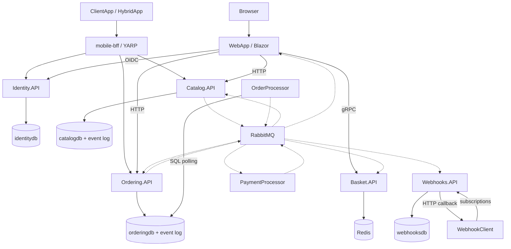

# eShop repository architecture map

This e-commerce sample demonstrates an Aspire-orchestrated system with synchronous storefront APIs, domain-driven order processing, and asynchronous integration events. This map is verified by source inspection, not runtime execution; no tests were run specifically for this documentation-only change, while the previously established baseline was 122 .NET tests and 4 Playwright tests passing. It is not a production-readiness assessment. Paths below are relative to the repository root.

## Purpose and user journeys

- Browse, filter, and inspect products; sign in; add products to a basket and change quantities; submit checkout and view order status. Entry points are `src/WebApp/Components/Pages/Catalog/Catalog.razor`, `src/WebApp/Components/Pages/Item/ItemPage.razor`, `src/WebApp/Components/Pages/Cart/CartPage.razor`, `src/WebApp/Components/Pages/Checkout/Checkout.razor`, and `src/WebApp/Components/Pages/User/Orders.razor`.
- Process orders through Submitted → AwaitingValidation → StockConfirmed → Paid, with cancellation and explicit shipping operations. `Order` in `src/Ordering.Domain/AggregatesModel/OrderAggregate/Order.cs` guards transitions; `OrdersApi` in `src/Ordering.API/Apis/OrdersApi.cs` exposes creation, queries, cancellation, shipping, and drafts.
- Demonstrate native/mobile shopping and webhook subscriptions. `src/ClientApp/MauiProgram.cs` registers real and mock services; `src/HybridApp/MauiProgram.cs` wires a Blazor WebView catalog client. Webhooks bridge price and order events to subscriber HTTP callbacks.

## System and components

Solid arrows represent request/data access; dotted arrows represent RabbitMQ integration events. Infrastructure is provisioned by `src/eShop.AppHost/Program.cs`.

The mobile diagram groups clients for readability: HybridApp wires catalog access only; ClientApp has separate configurable services, including Basket gRPC. The AppHost YARP routes do not include Basket (`ConfigureMobileBffRoutes`, `src/eShop.AppHost/Extensions.cs`).

## Aspire resources and startup

`src/eShop.AppHost/Program.cs` declares Redis `redis`, RabbitMQ `eventbus`, PostgreSQL `postgres`, four logical databases, project resources, YARP `mobile-bff`, and Azure Container Apps environment `aca`. PostgreSQL uses the pgvector image with the `latest` tag; PostgreSQL and RabbitMQ have persistent container lifetimes. A resource reference supplies configuration; it is distinct from an explicit `WaitFor` startup gate.

| Resource | References/configuration | Explicit startup gates |
| --- | --- | --- |
| `identity-api` | `identitydb`; client callback endpoints; `/health` probe | None |
| `basket-api` | Redis, eventbus, identity authority | eventbus |
| `catalog-api` | catalogdb, eventbus | eventbus |
| `ordering-api` | orderingdb, eventbus, identity authority; `/health` probe | eventbus, orderingdb |
| `order-processor` | orderingdb, eventbus | eventbus, ordering-api |
| `payment-processor` | eventbus | eventbus |
| `webhooks-api` | webhooksdb, eventbus, identity authority | eventbus |
| `webapp` | Basket, Catalog, Ordering, eventbus, identity/callback URLs | eventbus, identity-api |
| `webhooksclient` | Webhooks API, identity/callback URLs | None |
| `mobile-bff` | Catalog, Ordering, Identity routing | No explicit `WaitFor` |

Identity callback configuration is cyclic, but does not introduce a reciprocal `WaitFor`. `OrderProcessor` deliberately waits for Ordering.API because that API registers `AddMigration<OrderingContext, OrderingContextSeed>` (`src/Ordering.API/Extensions/Extensions.cs`). `MigrationHostedService<TContext>.StartAsync` performs migration and seeding during startup (`src/Shared/MigrateDbContextExtensions.cs`). Catalog, Identity, and Webhooks likewise register their own migrations.

Optional Foundry chat/embedding resources are enabled by `UseFoundry`; Catalog and WebApp wait for their respective deployments. The Ollama branch is disabled by a local boolean. Definitions and model wiring live in `AddFoundry` and `AddOllama`, `src/eShop.AppHost/Extensions.cs`.

## Executables and persistence boundaries

| Executable / source entry | Responsibility and data |
| --- | --- |
| `src/eShop.AppHost/Program.cs` | Distributed application composition and resource wiring. |
| `src/WebApp/Program.cs` | ASP.NET Core Blazor storefront, server interactivity, authenticated downstream clients, product-image forwarding, and event-driven order refresh. |
| `src/Catalog.API/Program.cs` | Product APIs, stock validation and reduction, optional semantic search; `catalogdb` via `CatalogContext`, including integration-event records. Wiring: `src/Catalog.API/Extensions/Extensions.cs`. |
| `src/Basket.API/Program.cs` | Authenticated gRPC basket operations; Redis storage through `RedisBasketRepository` in `src/Basket.API/Repositories/RedisBasketRepository.cs`. |
| `src/Ordering.API/Program.cs` | Authorized order HTTP API; MediatR commands, domain aggregates, EF Core writes and SQL queries. `OrderingContext` in `src/Ordering.Infrastructure/OrderingContext.cs` owns orders, items, buyers, payment methods, card types, request IDs, and integration-event records in `orderingdb`. Queries: `src/Ordering.API/Application/Queries/OrderQueries.cs`. |
| `src/OrderProcessor/Program.cs` | Background grace-period polling of shared `orderingdb`; emits confirmation events. No separate database. |
| `src/PaymentProcessor/Program.cs` | Simulates payment outcomes from `PaymentOptions.PaymentSucceeded`; publishes success/failure. No gateway integration or database. |
| `src/Identity.API/Program.cs` | ASP.NET Identity users in `identitydb`; IdentityServer with in-memory client/resource configuration and developer signing credentials. |
| `src/Webhooks.API/Program.cs` | Stores subscriptions in `webhooksdb`; consumes selected events and sends HTTP callbacks. Wiring: `src/Webhooks.API/Extensions/Extensions.cs`. |
| `src/WebhookClient/Program.cs` | Webhook demonstration client and receiver. |
| `src/ClientApp/MauiProgram.cs` | Native MAUI shopping client with selectable real/mock dependencies. |
| `src/HybridApp/MauiProgram.cs` | MAUI Blazor WebView catalog client sharing UI components. |

`mobile-bff` is an Aspire YARP resource, not a separate source project. Neither MAUI client is launched by AppHost. `Ordering.Domain`, `Ordering.Infrastructure`, `EventBus`, `EventBusRabbitMQ`, `IntegrationEventLogEF`, `eShop.ServiceDefaults`, and `WebAppComponents` are supporting libraries, not independent services. The four logical PostgreSQL databases share one server; OrderProcessor intentionally crosses the Ordering database ownership boundary.

## Shared runtime behavior

- **Identity:** `AddAuthenticationServices` in `src/WebApp/Extensions/Extensions.cs` configures cookies and OIDC authorization-code login, saves tokens, and attaches authentication to HTTP/gRPC clients. `AddDefaultAuthentication` in `src/eShop.ServiceDefaults/AuthenticationExtensions.cs` configures API JWT bearer authentication from the `Identity` section. Ordering endpoints require authorization in `src/Ordering.API/Program.cs`.
- **Discovery and resilience:** `AddServiceDefaults` in `src/eShop.ServiceDefaults/Extensions.cs` installs service discovery and `AddStandardResilienceHandler` for configured HTTP clients. WebApp uses logical addresses such as `https+http://ordering-api` and `http://basket-api` (`src/WebApp/Extensions/Extensions.cs`). `AddBasicServiceDefaults` provides telemetry/health without those outgoing HTTP defaults; it is used by OrderProcessor. Resilience configuration is not proof of end-to-end business success.
- **Health:** `AddDefaultHealthChecks` registers a `self` check tagged `live`; `MapDefaultEndpoints` exposes all registered checks at `/health` and live-tagged checks at `/alive`, only in Development (`src/eShop.ServiceDefaults/Extensions.cs`). Resource integrations use Aspire Redis, RabbitMQ, and Npgsql registration/enrichment APIs; exact dependency-check behavior remains package/configuration dependent.
- **OpenTelemetry:** `ConfigureOpenTelemetry` collects logs with scopes/formatted messages, ASP.NET Core/HTTP/runtime metrics, ASP.NET Core/HTTP/gRPC-client traces, and AI instrumentation. Development uses an always-on trace sampler; OTLP export requires `OTEL_EXPORTER_OTLP_ENDPOINT`. RabbitMQ adds its own activity source and propagates trace context in message headers (`src/EventBusRabbitMQ/RabbitMqDependencyInjectionExtensions.cs`, `src/EventBusRabbitMQ/RabbitMQEventBus.cs`). Migrations add a `DbMigrations` activity source.

## Verified checkout trace

1. **WebApp composes the request.** `src/WebApp/Components/Pages/Checkout/Checkout.razor` calls `BasketState.CheckoutAsync` in `src/WebApp/Services/BasketState.cs`. It creates/reuses a request ID, resolves the signed-in buyer, and combines Basket quantities with Catalog product details through `FetchBasketItemsAsync`. `OrderingService.CreateOrder` in `src/WebApp/Services/OrderingService.cs` posts `/api/orders/` with `x-requestid`. The browser does not publish a checkout event.
2. **Ordering dispatches a command.** `OrdersApi.CreateOrderAsync` in `src/Ordering.API/Apis/OrdersApi.cs` validates the request ID, masks the card number, wraps `CreateOrderCommand` in `IdentifiedCommand<CreateOrderCommand, bool>`, and sends it through MediatR. Logging, validation, and transaction behaviors are registered in `src/Ordering.API/Extensions/Extensions.cs`.
3. **Local transaction and outbox.** `TransactionBehavior<TRequest,TResponse>.Handle` in `src/Ordering.API/Application/Behaviors/TransactionBehavior.cs` opens the outer transaction; nested commands reuse it. `IdentifiedCommandHandler.Handle` records the request ID. `CreateOrderCommandHandler.Handle` in `src/Ordering.API/Application/Commands/CreateOrderCommandHandler.cs` saves `OrderStartedIntegrationEvent`, builds the Order and items, and calls `SaveEntitiesAsync`. `OrderingContext.SaveEntitiesAsync` dispatches domain events before saving. `ValidateOrAddBuyerAggregateWhenOrderStartedDomainEventHandler.Handle` in `src/Ordering.API/Application/DomainEventHandlers/ValidateOrAddBuyerAggregateWhenOrderStartedDomainEventHandler.cs` validates/creates buyer and payment data and queues `OrderStatusChangedToSubmittedIntegrationEvent`.
4. **Commit precedes RabbitMQ.** `IntegrationEventLogService<TContext>.SaveEventAsync` in `src/IntegrationEventLogEF/Services/IntegrationEventLogService.cs` saves event records under the same database transaction. After `CommitTransactionAsync`, the transaction behavior invokes `OrderingIntegrationEventService.PublishEventsThroughEventBusAsync` (`src/Ordering.API/Application/IntegrationEvents/OrderingIntegrationEventService.cs`). Records move through NotPublished → InProgress → Published, or PublishedFailed on publication exceptions. This is local atomicity plus subsequent delivery, not a distributed transaction.
5. **Basket clears independently.** `RabbitMQEventBus.PublishAsync` routes JSON by event type name on the direct exchange `eshop_event_bus` (`src/EventBusRabbitMQ/RabbitMQEventBus.cs`). `OrderStartedIntegrationEventHandler.Handle` in `src/Basket.API/IntegrationEvents/EventHandling/OrderStartedIntegrationEventHandler.cs` deletes the buyer's Redis basket. Separately, WebApp's `CheckoutAsync` calls `DeleteBasketAsync` after the HTTP task completes; the two deletion paths have no guaranteed relative order.
6. **Grace period initiates stock validation.** `GracePeriodOrdersRepository.GetConfirmedGracePeriodOrdersAsync` in `src/OrderProcessor/Services/GracePeriodOrdersRepository.cs` queries old Submitted orders. `GracePeriodManagerService.CheckConfirmedGracePeriodOrders` in `src/OrderProcessor/Services/GracePeriodManagerService.cs` publishes `GracePeriodConfirmedIntegrationEvent`. Ordering's `GracePeriodConfirmedIntegrationEventHandler.Handle` (`src/Ordering.API/Application/IntegrationEvents/EventHandling/GracePeriodConfirmedIntegrationEventHandler.cs`) sends `SetAwaitingValidationOrderStatusCommand`; the resulting domain handler queues `OrderStatusChangedToAwaitingValidationIntegrationEvent` (`src/Ordering.API/Application/DomainEventHandlers/OrderStatusChangedToAwaitingValidationDomainEventHandler.cs`).
7. **Catalog answers availability.** `OrderStatusChangedToAwaitingValidationIntegrationEventHandler.Handle` in `src/Catalog.API/IntegrationEvents/EventHandling/OrderStatusChangedToAwaitingValidationIntegrationEventHandler.cs` checks available stock and emits `OrderStockConfirmedIntegrationEvent` or `OrderStockRejectedIntegrationEvent`. `CatalogIntegrationEventService.SaveEventAndCatalogContextChangesAsync` and `PublishThroughEventBusAsync` in `src/Catalog.API/IntegrationEvents/CatalogIntegrationEventService.cs` persist then publish. Ordering translates confirmation into `SetStockConfirmedOrderStatusCommand` and a StockConfirmed status event; rejection invokes `SetStockRejectedOrderStatusCommand` and cancels the order. `Order.SetCancelledStatusWhenStockIsRejected` changes state without raising the cancellation domain event used by ordinary cancellation.
8. **Payment and inventory complete asynchronously.** `OrderStatusChangedToStockConfirmedIntegrationEventHandler.Handle` in `src/PaymentProcessor/IntegrationEvents/EventHandling/OrderStatusChangedToStockConfirmedIntegrationEventHandler.cs` directly publishes a simulated payment success/failure. Ordering's handlers in `src/Ordering.API/Application/IntegrationEvents/EventHandling/OrderPaymentSucceededIntegrationEventHandler.cs` and `src/Ordering.API/Application/IntegrationEvents/EventHandling/OrderPaymentFailedIntegrationEventHandler.cs` send `SetPaidOrderStatusCommand` or `CancelOrderCommand`. The Paid domain handler queues the paid event (`src/Ordering.API/Application/DomainEventHandlers/OrderStatusChangedToPaidDomainEventHandler.cs`). Catalog reduces inventory on that event (`src/Catalog.API/IntegrationEvents/EventHandling/OrderStatusChangedToPaidIntegrationEventHandler.cs`). WebApp consumes status events and notifies buyer subscriptions through `OrderStatusNotificationService` in `src/WebApp/Services/OrderStatus/OrderStatusNotificationService.cs`; Webhooks consumes Paid/Shipped events. Shipping is a later explicit API action.

## Communication contracts

“Synchronous” here means request/response, even when implemented with C# async methods.

| Mode | Sender → receiver | Contract / source |
| --- | --- | --- |
| HTTP | WebApp → Catalog / Ordering | Typed clients in `src/WebApp/Extensions/Extensions.cs`; checkout and order queries in `src/WebApp/Services/OrderingService.cs`. |
| gRPC | WebApp → Basket | `Basket.BasketClient`; contract in `src/Basket.API/Proto/basket.proto`. |
| HTTP/OIDC | WebApp → Identity | `AddAuthenticationServices`, `src/WebApp/Extensions/Extensions.cs`. |
| HTTP proxy | Mobile → YARP → Catalog / Ordering / Identity | `ConfigureMobileBffRoutes`, `src/eShop.AppHost/Extensions.cs`; HybridApp currently registers Catalog only. |
| HTTP callback | Webhooks → subscriber | `WebhooksSender.SendAll` / `OnSendData`, `src/Webhooks.API/Services/WebhooksSender.cs`; triggered by events but delivered as HTTP. |
| Integration event | Ordering → Basket | `OrderStartedIntegrationEvent`; Basket handler in checkout step 5. |
| Integration event | OrderProcessor → Ordering → Catalog | `GracePeriodConfirmedIntegrationEvent`, then `OrderStatusChangedToAwaitingValidationIntegrationEvent`; checkout step 6. |
| Integration event | Catalog → Ordering | `OrderStockConfirmedIntegrationEvent` / `OrderStockRejectedIntegrationEvent`; checkout step 7. |
| Integration event | Ordering → PaymentProcessor → Ordering | `OrderStatusChangedToStockConfirmedIntegrationEvent`, then `OrderPaymentSucceededIntegrationEvent` / `OrderPaymentFailedIntegrationEvent`; checkout step 8. |
| Integration event | Ordering → Catalog / WebApp / Webhooks | Paid → all three; other status subscriptions vary. See `src/WebApp/Extensions/Extensions.cs` and `src/Webhooks.API/Extensions/Extensions.cs`. |
| Integration event | Catalog → Webhooks | `ProductPriceChangedIntegrationEvent`; subscription in `src/Webhooks.API/Extensions/Extensions.cs`. |

MediatR domain events are in-process notifications, not RabbitMQ messages. OrderProcessor's SQL polling is direct database access, not an Ordering HTTP call.

## Source-backed risk register

Observed behavior is distinguished from inferred consequences; investigation items are follow-up work, not verified failures.

| Risk | Source evidence and consequence / investigation |
| --- | --- |
| Failed outbox delivery has no discovered automatic recovery | **Observed:** `OrderingIntegrationEventService.PublishEventsThroughEventBusAsync` and `CatalogIntegrationEventService.PublishThroughEventBusAsync` mark failures; `IntegrationEventLogService.MarkEventAsFailedAsync` sets `PublishedFailed`. `RetrieveEventLogsPendingToPublishAsync` selects only NotPublished records for one transaction. Source search found no automatic recovery mechanism. Paths: `src/Ordering.API/Application/IntegrationEvents/OrderingIntegrationEventService.cs`, `src/Catalog.API/IntegrationEvents/CatalogIntegrationEventService.cs`, `src/IntegrationEventLogEF/Services/IntegrationEventLogService.cs`. **Inference:** failed or crash-interrupted delivery can strand workflow state. **Investigate:** durable replay and recovery of InProgress records; broker publish retries are not outbox recovery. |
| Basket deletion after unsuccessful HTTP response | **Observed:** `OrderingService.CreateOrder` returns `SendAsync` as `Task` without inspecting unsuccessful status responses; `BasketState.CheckoutAsync` then deletes the basket. Paths: `src/WebApp/Services/OrderingService.cs`, `src/WebApp/Services/BasketState.cs`. **Inference:** a returned error response can still clear the basket; transport exceptions differ because they interrupt the await. |
| False command result still returns OK | **Observed:** `OrdersApi.CreateOrderAsync` logs the false MediatR result but unconditionally returns `TypedResults.Ok()` after it. Path: `src/Ordering.API/Apis/OrdersApi.cs`. **Inference:** HTTP status alone cannot establish successful creation in this implementation. |
| Failed request ID may remain recorded | **Observed:** `IdentifiedCommandHandler.Handle` records the ID before dispatch, catches inner exceptions, and returns default. `RequestManager.CreateRequestForCommandAsync` saves the record; the outer transaction behavior can then commit. Paths: `src/Ordering.API/Application/Commands/IdentifiedCommandHandler.cs`, `src/Ordering.Infrastructure/Idempotency/RequestManager.cs`, `src/Ordering.API/Application/Behaviors/TransactionBehavior.cs`. **Inference:** failures that leave the transaction committable may preserve the ID and suppress retries; not every database failure permits commit. Duplicate creation returns true in `CreateOrderIdentifiedCommandHandler`, `src/Ordering.API/Application/Commands/CreateOrderCommandHandler.cs`. |
| Sensitive structured logging | **Observed:** command destructuring occurs in `OrdersApi.CreateOrderAsync`, `LoggingBehavior.Handle`, and `IdentifiedCommandHandler.Handle`; `CreateOrderCommand.CardSecurityNumber` remains available. `CreateOrderCommandHandler.Handle` destructures Order before domain events are cleared; `Entity.DomainEvents` exposes an `OrderStartedDomainEvent` carrying `CardSecurityNumber`. Paths: `src/Ordering.API/Apis/OrdersApi.cs`, `src/Ordering.API/Application/Behaviors/LoggingBehavior.cs`, `src/Ordering.API/Application/Commands/IdentifiedCommandHandler.cs`, `src/Ordering.API/Application/Commands/CreateOrderCommand.cs`, `src/Ordering.API/Application/Commands/CreateOrderCommandHandler.cs`, `src/Ordering.Domain/SeedWork/Entity.cs`, `src/Ordering.Domain/Events/OrderStartedDomainEvent.cs`. **Inference:** structured logging may expose this field through command or Order destructuring, depending on the provider. **Investigate:** serialization/redaction at every sink; masking the card number does not redact this field. |
| Health endpoints absent outside Development | **Observed:** `MapDefaultEndpoints` gates `/health` and `/alive` on Development, while AppHost configures `/health` probes for some services. Paths: `src/eShop.ServiceDefaults/Extensions.cs`, `src/eShop.AppHost/Program.cs`. **Investigate:** non-Development probe configuration and startup gates. |
| OrderProcessor startup/schema coupling | **Observed:** AppHost explicitly waits for Ordering.API because it owns migrations; the processor queries `ordering.orders` directly. Paths: `src/eShop.AppHost/Program.cs`, `src/Ordering.API/Extensions/Extensions.cs`, `src/OrderProcessor/Services/GracePeriodOrdersRepository.cs`. **Inference:** independent processor deployment requires an explicit schema-readiness contract. |
| Consumer failures are acknowledged | **Observed:** `RabbitMQEventBus.OnMessageReceived` catches handler exceptions and still calls `BasicAckAsync`; it comments that a dead-letter exchange is needed for a real deployment. Path: `src/EventBusRabbitMQ/RabbitMQEventBus.cs`. **Inference:** failed consumption can lose workflow progress despite publisher-side event logs. |
| Availability is not reserved | **Observed:** Catalog checks stock at validation and removes it only after Paid; missing products are skipped during validation. Paths: `src/Catalog.API/IntegrationEvents/EventHandling/OrderStatusChangedToAwaitingValidationIntegrationEventHandler.cs`, `src/Catalog.API/IntegrationEvents/EventHandling/OrderStatusChangedToPaidIntegrationEventHandler.cs`. **Inference:** concurrent orders can pass the same availability check, and absent products may escape rejection. **Investigate:** reservations, missing-item rejection, and duplicate paid-event handling. |
| Sample authentication configuration | **Observed:** developer signing credentials and disabled key management in `src/Identity.API/Program.cs`; disabled audience validation and HTTPS metadata requirement in `AddDefaultAuthentication`, `src/eShop.ServiceDefaults/AuthenticationExtensions.cs`. **Investigate:** signing-key lifecycle, audience boundaries, and transport requirements before deployment. |

## Read these ten files first

1. `src/eShop.AppHost/Program.cs` — topology and startup gates.
2. `src/eShop.ServiceDefaults/Extensions.cs` — discovery, resilience, health, and telemetry.
3. `src/WebApp/Extensions/Extensions.cs` — storefront clients, authentication, and subscriptions.
4. `src/WebApp/Services/BasketState.cs` — basket composition and checkout orchestration.
5. `src/WebApp/Services/OrderingService.cs` — checkout HTTP boundary.
6. `src/Ordering.API/Apis/OrdersApi.cs` — order API contracts and result handling.
7. `src/Ordering.API/Application/Commands/CreateOrderCommandHandler.cs` — aggregate creation and initial event.
8. `src/Ordering.API/Application/Behaviors/TransactionBehavior.cs` — transaction/dispatch boundary.
9. `src/Ordering.API/Application/IntegrationEvents/OrderingIntegrationEventService.cs` — persisted-event publication.
10. `src/EventBusRabbitMQ/RabbitMQEventBus.cs` — routing, consumption, acknowledgements, and trace propagation.
